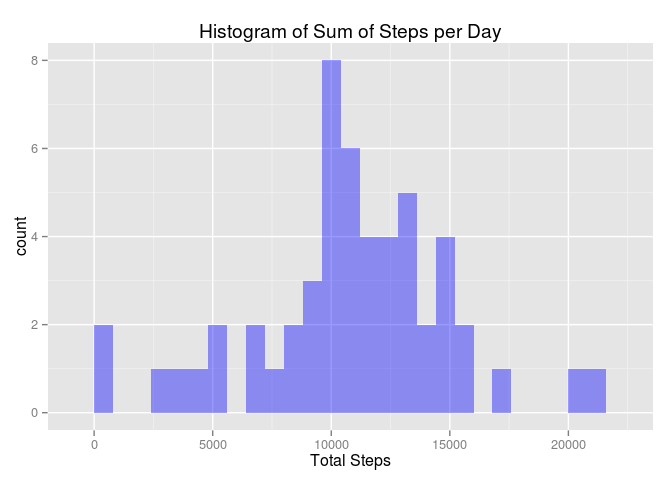
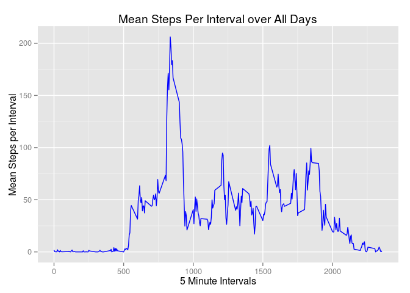
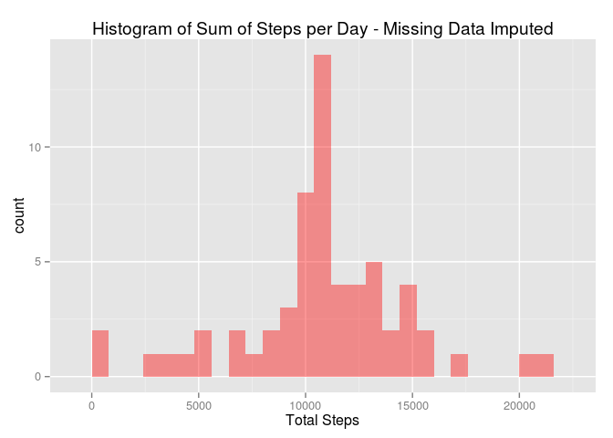
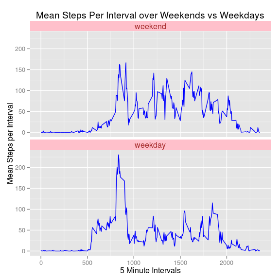

# Reproducible Research: Peer Assessment 1
Ron Segal  
`r format(Sys.time(), '%B %d %Y')`  

### Script was created on Friday 17th April 2015

## Initialisation

*Note - Created and run on Ubuntu Linux 14.04, using R Studio Version 0.98.1091*


```r
setwd("~/Coursera/RepRes/RepData_PeerAssessment1")
```

### Load required packages


```r
#install.packages("broman")
library(broman) # included for its rounding function
library(ggplot2)
library(plyr)
library(grid)
```

## Loading and preprocessing the data


```r
# Download data if activity.zip doesn't exist
if (!file.exists("activity.csv")) {  
  if (!file.exists("activity.zip")) {
      dataUrl <- "https://d396qusza40orc.cloudfront.net/repdata%2Fdata%2Factivity.zip"
      download.file(dataUrl, destfile="activity.zip", method="wget")
  }
  unzip(zipfile="activity.zip",exdir="./")
}  
```


```r
# Read in data
activitydata<-read.csv(file="activity.csv", head=TRUE, sep = ",")
```

## What is mean total number of steps taken per day?


```r
# Create data frame with sum of steps per day
stepstotal<-ddply(activitydata, c("date"), summarise, stepsum = sum(steps))

qplot(stepstotal$stepsum, geom="histogram", binwidth=800, xlab="Total Steps", main="Histogram of Sum of Steps per Day", fill=I("blue"),alpha=I(.4))
```

 

```r
meansteps<-as.integer(mean(stepstotal$stepsum,na.rm=TRUE))
mediansteps<-median(stepstotal$stepsum, na.rm=TRUE)
```

The mean total number of steps per day is: **10766**

The median total number of steps per day is: **10765**

## What is the average daily activity pattern?


```r
# Calculate the mean steps per interval across all days
stepsmean<-ddply(activitydata,c("interval"), summarise, mean = mean(steps,na.rm=TRUE))

ggplot(stepsmean, aes(x=stepsmean$interval, y=stepsmean$mean)) + geom_line(color="blue", stat="identity",binwidth=2) + labs(x="5 Minute Intervals", y="Mean Steps per Interval") + ggtitle("Mean Steps Per Interval over All Days")
```

 

The 5-minute interval (from 0 to 2355 minutes), on average across all the days in the dataset, that contains the maximum number of steps is: **835** or
2.8 hours into the measured period for the day.

## Imputing missing values


```r
# Calculate number of rows with missing data
# Only the steps variable column contains missing data
totalmissing<-sum(is.na(activitydata$steps))
```

The total number of missing values in the dataset is: **2304**

The strategy used to fill in all of the missing values is to replace them with means for each interval across all days.


```r
# Create new data set with column containing interval means across all day
newdata<-join(activitydata,stepsmean, by = "interval")
# Replace missing values in step column with corresponding interval means
newdata$steps[is.na(newdata$steps)]<-newdata$mean[is.na(newdata$steps)]

stepstotal<-ddply(newdata, c("date"), summarise, stepsum = sum(steps))
qplot(stepstotal$stepsum, geom="histogram", binwidth=800, xlab="Total Steps", main="Histogram of Sum of Steps per Day - Missing Data Imputed", fill=I("red"),alpha=I(.4))
```

 

```r
meansteps<-as.integer(mean(stepstotal$stepsum,na.rm=TRUE))
mediansteps<-as.integer(median(stepstotal$stepsum, na.rm=TRUE))
```

Adjusted for missing data, the mean total number of steps per day is: **10766**

Adjusted for missing data, the median total number of steps per day is: **10766**

## Are there differences in activity patterns between weekdays and weekends?


```r
# Set time zone to Coordinated Universal Time
Sys.setenv(TZ='UTC')

# Create factor variable
weekDay<-c('Monday','Tuesday','Wednesday','Thursday','Friday')

# Add weekday/weekend 2 level factor column to data frame
newdata$day<-factor((weekdays(as.Date(newdata$date)) %in% weekDay)+1L, levels=1:2, labels=c('weekend','weekday'))
```

*NB - the time zone of the experimental data isn't clear so UTC has been assumed and specifically set. This gives the first day of the data set as:* ***Monday*** 


```r
# Calculate the mean steps per interval across days
daytype<-ddply(newdata, c("interval","day"), summarise, mean = mean(steps))

# The ggplot itself creates panels depending on the factor level in the day variable
ggplot(daytype, aes(x=interval, y=mean)) + geom_line(color="blue", stat="identity",binwidth=2) + labs(x="5 Minute Intervals", y="Mean Steps per Interval") + ggtitle("Mean Steps Per Interval over Weekends vs Weekdays") + facet_wrap(~day,ncol=1) + theme(strip.text.x=element_text(size=12, colour = "brown")) + theme(strip.background = element_rect(fill="pink"))
```


Interpretation: It appears from eyeballing the area under the curves that there is generally more activity at weekends (implication perhaps that the subject has a desk job!)

